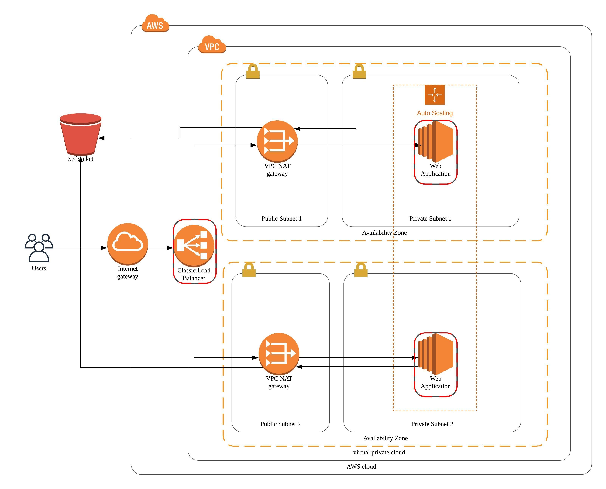

# Deploy a high-availability application using CloudFormation.
## Introduction
This is a project of Cloud DevOps Engineer Nanodegree Program.
## App Website:
http://proje-WebAp-8N8S533XCRC8-1751777767.us-west-2.elb.amazonaws.com
 ## How to Build
 ./create.bat project2-network network.yml network-params.json
 
 ./create.bat project2-role role.yml serversrole-params.json
 
 ./create.bat project2-servers servers.yml serversrole-params.json
## Architecture Diagram

